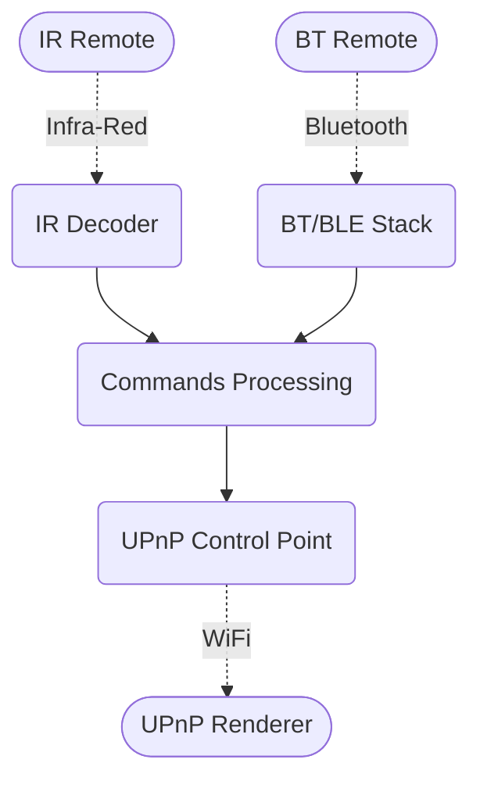

# ESP32 UPnP remote controller

The purpose of this project is to create an UPnP control point controlled by
infrared or bluetooth remote. It works with custom
[esp-ir-receiver](https://github.com/valletw/esp-ir-receiver) based on ESP32 chip.

## Software design



## Build and program

For fast development, this project uses PlatformIO tools.

```shell
# Build project.
pio run

# Clean build files.
pio run --target clean

# Upload firmware.
pio run --target upload

# Erase device.
pio run --target erase
```

## Supported commands

The following control commands are:

- **Play/Pause**: Resume/Suspend the stream
- **Previous**: Request previous stream
- **Next**: Request next stream
- **Volume up**: Increase the volume
- **Volume down**: Decrease the volume
- **Mute**: Cut off the volume
